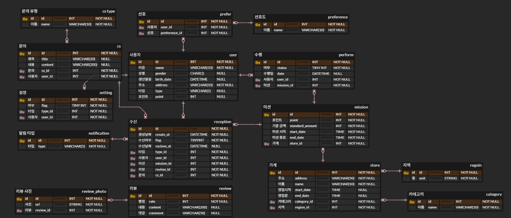

# Mission : 0주차 때 **직접 설계한** 데이터베이스를 토대로 작성한 쿼리

### 설계한 DB 사진



## 1️⃣ 리뷰 가져오기

### 필요한 데이터

| 데이터   | 출처 테이블  |
| -------- | ------------ |
| user_id  | review       |
| 별점     | review       |
| 날짜     | review       |
| 리뷰내용 | review       |
| 답글내용 | review       |
| 리뷰사진 | review_photo |

### 조회 방법

- 리뷰 테이블에서 `store_id`로 검색
- 사진은 `review_id`로 조회
- 사진 없는 리뷰도 있어 **LEFT JOIN** 사용

```sql
SELECT *
FROM review r
LEFT JOIN review_photo pt
  ON r.id = pt.review_id
WHERE r.store_id = {store_id};
```

## 2️⃣ 마이페이지 조회하기

### 필요한 데이터

| 데이터     | 출처 테이블 |
| ---------- | ----------- |
| 닉네임     | user        |
| 이메일     | user        |
| 휴대폰번호 | user        |
| 포인트     | user        |

### 조회 방법

- user 테이블에서 포인트도 저장하고 있어 user 테이블만 조회하면 됨

```sql
select * from user
where id = 유저 아이디;
```

## 3️⃣ 진행중 / 완료 미션 조회하기

### 필요한 데이터

| 데이터         | 출처 테이블 |
| -------------- | ----------- |
| 미션 포인트    | mission     |
| 미션 기준 금액 | mission     |
| 가게 이름      | store       |
| 미션 수행 여부 | perform     |

### 조회 방법

- 미션, 가게, 수행 총 3개의 테이블을 조인해야 함
- 수행 테이블, 미션 테이블의 미션 id , 미션 테이블과 가게 테이블의 가게 id를 중심으로 조인
  1. mission_id를 중심으로 가져오면.. 미션 아이디가 많은데?? 이상하게 중복 될 것 같음… 일단 user_id로 먼저 조건분기하자
  2. N:M이 아니라 1:N이라 이상은 생기지 않는다고 함
- 3개 다 inner join으로 하면 될 듯함
- join 후 where 문으로 user_id, 수행 여부로 조건 분기하면 될 듯

```sql
select * from perform p
JOIN mission m on p.mission_id = m.id
JOIN store s on m.store_id = s.id
where p.user_id = 유저 아이디 and p.status = 수행 여부;
```

## 4️⃣ 홈 화면 (현재 선태된 지역에서 도전 가능한 미션 조회하기)

### 필요한 데이터

| 데이터         | 출처 테이블 |
| -------------- | ----------- |
| 미션 포인트    | mission     |
| 미션 기준 금액 | mission     |
| 가게 이름      | store       |
| 미션 수행 여부 | perform     |
| 지역 id        | region      |

### 조회 방법

- 미션 가져오기는 3번째 쿼리문을 이용하면 됨
- 지역 테이블은 조인하는 것보단 특정 지역 하나만 가져오는 거라서 단일 값 조회면 서브쿼리가 낫다고 함
- 커서 페이징을 사용하고 마감 날짜 빠른 순으로 10개씩 가져온다고 가정

```sql
select * from perfom p
join mission m on p.mission_id = m.id
join store s on m.store_id = s.id
where p.user_id = 유저 아이디 and p.status = 0
and s.region_id = (select r.id from regoin r where unit = 지역명)
and (p.end_date > 마지막 날짜 or (p.end_date = 날짜 and p.id > 마지막 id))
order by p.end_date desc, p.id desc
limit 10;
```

### 💡 추가

- 커서 페이징에서 and, or 조건문보다 튜플이 훨씬 가독성도 좋고 이해하기 쉽다는 것을 깨달음

```sql
p.end_date > 마지막 날짜 or (p.end_date = 날짜 and p.id > 마지막 id)
```

```sql
(p.end_date,p.id) > (마지막 날짜, 마지막 id)
```

- 커서 페이징에서 쓰는 방법은 알겠으나 왜 id를 정렬해야 되는지 약간 헷갈렸는데
  스터디에서 설명을 들으니 왜 해야되는지 이해가 갔다(당연히 해야 되는 거였음)

```sql
order by p.end_date desc, p.id desc
```
